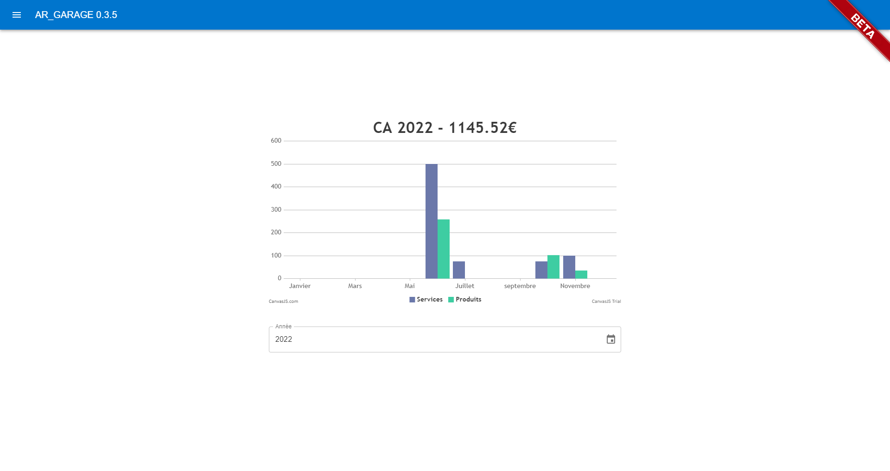
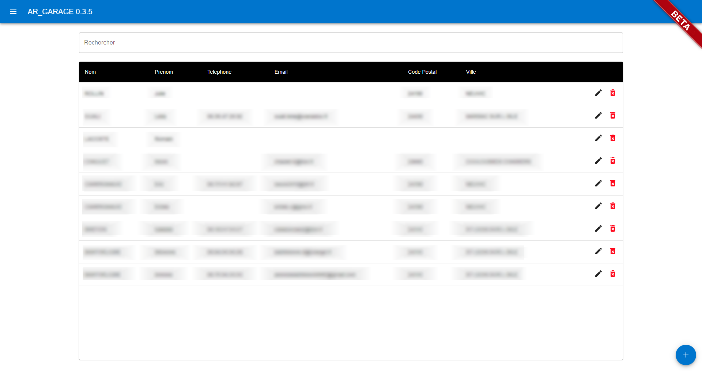
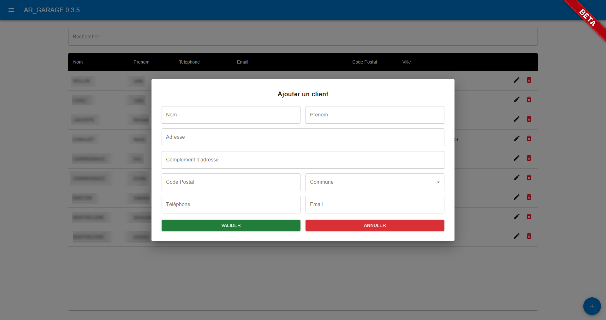
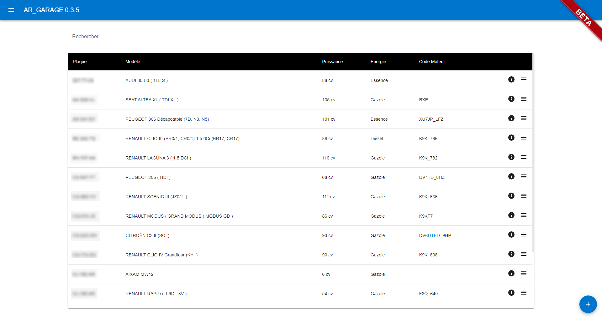
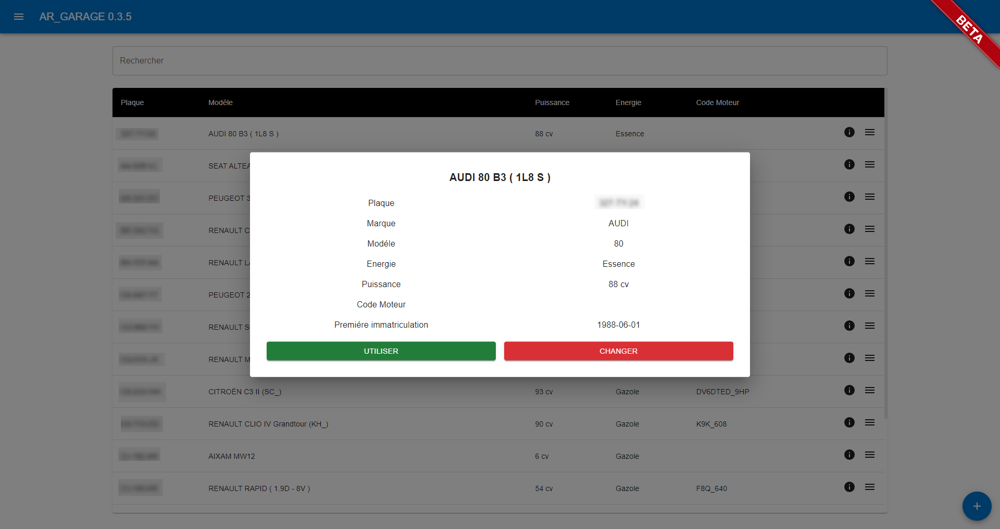
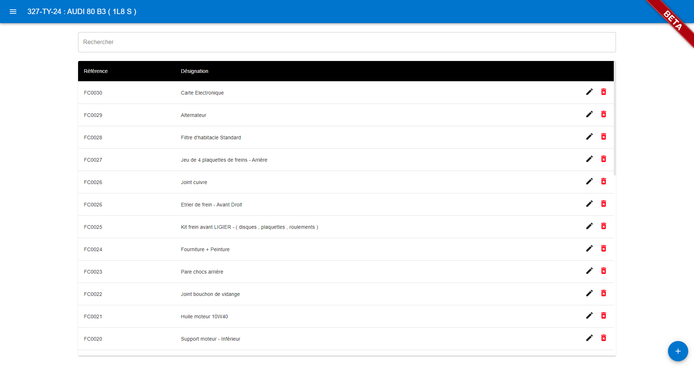
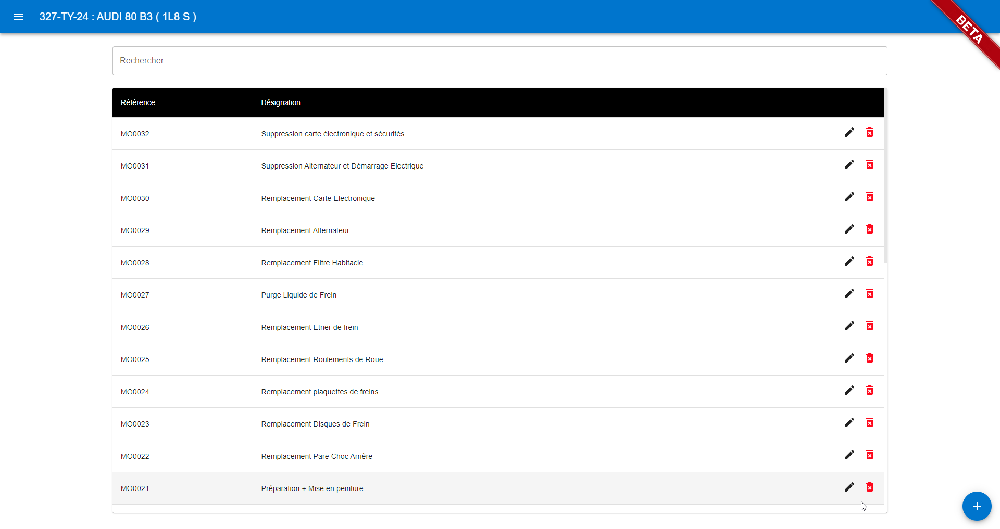
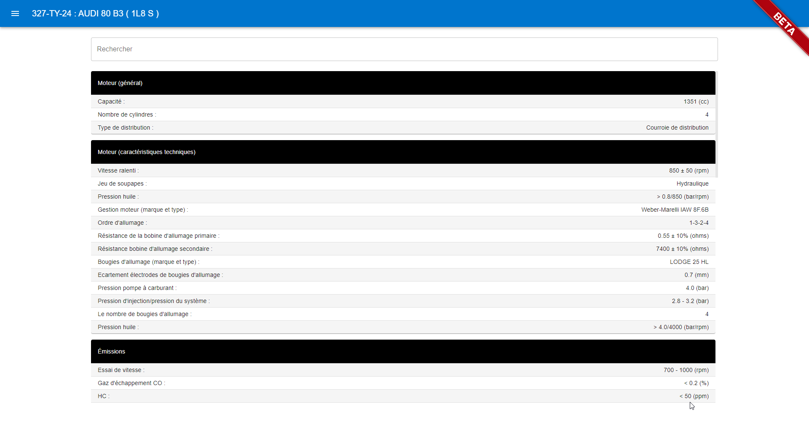

# AR_Garage
Un petit utilitaire de generation de devis et de facture pour micro entreprise

    

# Documentation

## Prérequis

- Windows 10 / 11 - 64 Bits
- Espace disque 1 Go
- Connection internet ( pour la recherche par plaque et les mises a jours automatique )
- Fichier d'installation windows : 

## Utilisation

Configurer votre Entreprise / Garage , importer votre Logo pour l'edition des Devis et factures grace a l'aide a la configuration

Simplifier le calcul du chiffre d'affaire en fonction dela vente de piéces et de services, avec la possibilité de choisir l'année

Gérer , rechercher , ajouter, editer votre base de donnée client

Gérer , rechercher , ajouter, editer votre base de donnée véhicule,
Ajout automatique par plaque , ou manuel

Gérer , rechercher , ajouter, editer votre base de donnée Produit , piéces détachhées et de prestation de service,

Gérer vos devis et factures , vérifier le status en un coup d'oeil avec une visualisation simplifier.
Vous pouvez directement generer un pdf et l'envoyer par mail a votre client.

Le logiciel inclus aussi une base de donnée technique préinstaller et mis a jours des que possible

